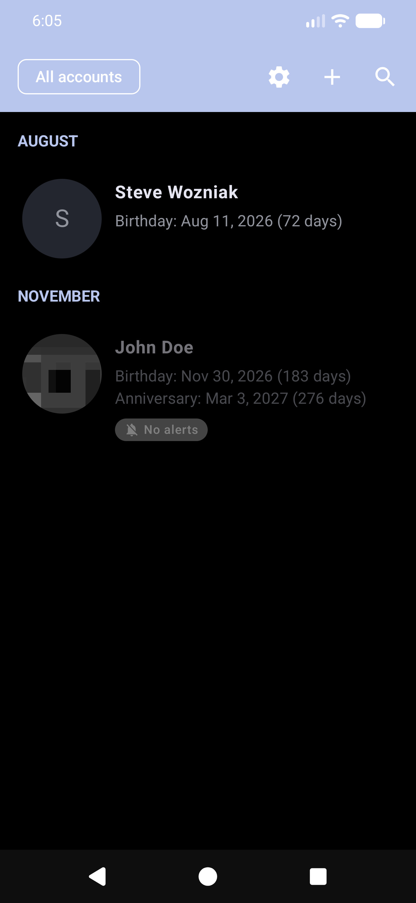
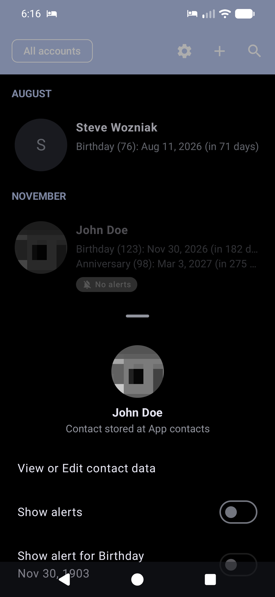
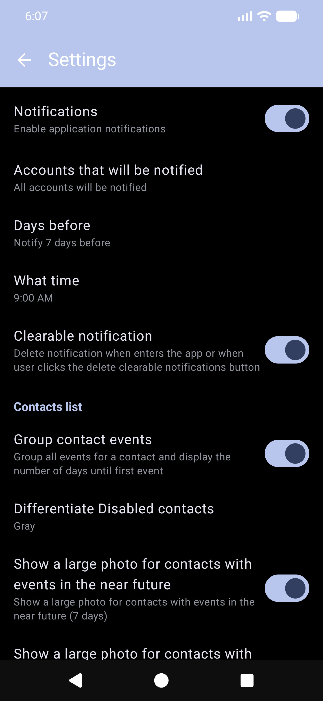
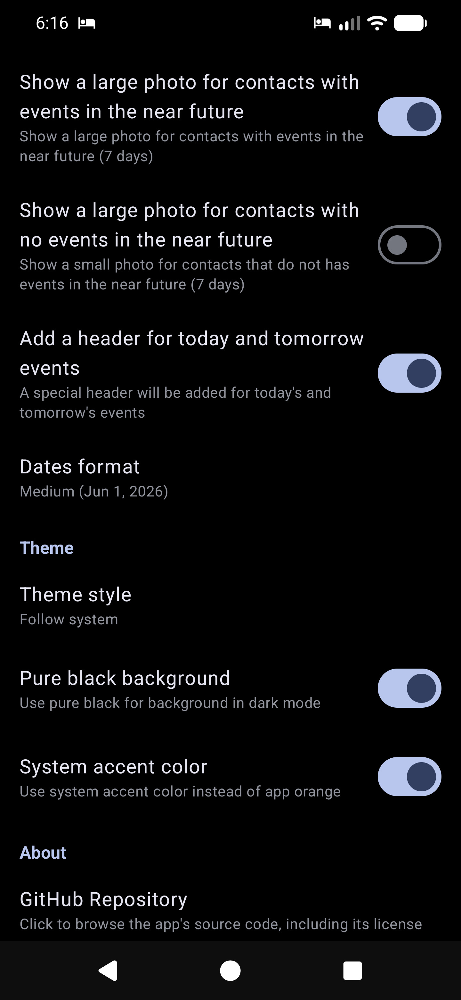

<p align="center">
  
</p>

<h1 align="center">Birthdays Notifier</h1>

<p align="center">
  <b>Never miss a birthday, anniversary, or special event again.</b>
</p>

<p align="center">
  <a href="https://github.com/ryosoftware/birthdays-notifier/releases">
    
  </a>
  <a href="LICENSE.md">
    
  </a>
  
  
  
  
</p>

---

## 📱 About

**Birthdays Notifier** is a beautiful, privacy-first Android app that keeps you informed about upcoming contact events — birthdays, anniversaries, namedays, or any custom date you want to remember. It works with synced accounts, local (device-only) contacts, and even lets you create contacts directly inside the app.

No internet permission required. Your data stays on your device.

---

## ✨ Features

### 🎯 Core
- **Smart notifications** — get reminded days in advance, configurable per account, contact, or event
- **Multi-account support** — syncs with Google, Samsung, or any device account; includes local & app-only contacts
- **Powerful filtering** — view all contacts or filter by account with one tap
- **Search** — find any contact instantly

### 🎨 Experience
- **Modern Material 3 UI** — built with Jetpack Compose, dynamic colors (Android 12+), light/dark/system theme
- **AMOLED pure black mode** — perfect for OLED screens
- **Large contact photos** — optionally show big photos for upcoming events
- **Smart grouping** — events organized by Today, Tomorrow, This Week, Next Week, This Month, and beyond

### 🧩 Per-contact control
- **Disable alerts** per contact or per individual event
- **Dismiss notifications** until next year or until the event day itself
- **Notes** per contact — add reminders or gift ideas
- **Zodiac sign** — automatically shown for birthdays
- **Contact groups** — see which groups your contacts belong to

### 🎉 Celebrations
- **Balloon animation overlay** — a delightful celebration when there's an event today!

### 🔒 Privacy & Security
- **Zero internet permission** — the app works completely offline
- **Open source** — fully auditable code
- **Certificate pinned** — verify APK authenticity via SHA-256

---

## 📸 Screenshots

<p align="center">
  
  
  
  
</p>

---

## 📲 Download

| Source | Link |
|--------|------|
| **GitHub Releases** | [Latest release](https://github.com/ryosoftware/birthdays-notifier/releases) |

---

## 🛠 Tech Stack

| Layer | Technology |
|-------|-----------|
| Language | [Kotlin](https://kotlinlang.org/) 2.2 |
| UI | [Jetpack Compose](https://developer.android.com/jetpack/compose) + Material 3 |
| Navigation | Navigation Compose |
| Architecture | MVVM (ViewModel + StateFlow) |
| Background tasks | WorkManager |
| Data persistence | DataStore Preferences + Room |
| Image loading | Coil |
| Image cropping | Android Image Cropper |
| Min / Target SDK | Android 6.0 (API 23) / Android 16 (API 36) |

---

## 🔐 Certificate Signature Verification

The SHA-256 digest of the certificate used to sign the app is **constant across all versions**:

```
418a24b64afdd2c280e113e816e06776fd837b6f1b17b67c603117971e0b88b5
```

Verify with:

```bash
apksigner verify --verbose --print-certs app-release.apk \
  | grep "Signer #1 certificate SHA-256 digest"
```

---

## ⚠️ Disclaimer

THIS SOFTWARE IS PROVIDED "AS IS" AND ANY EXPRESS OR IMPLIED WARRANTIES, INCLUDING, BUT NOT LIMITED TO, THE IMPLIED WARRANTIES OF MERCHANTABILITY AND FITNESS FOR A PARTICULAR PURPOSE ARE DISCLAIMED.

IN NO EVENT SHALL WE BE LIABLE FOR ANYONE DIRECT, INDIRECT, INCIDENTAL, SPECIAL, EXEMPLARY, OR CONSEQUENTIAL DAMAGES (INCLUDING, BUT NOT LIMITED TO, PROCUREMENT OF SUBSTITUTE GOODS OR SERVICES; LOSS OF USE, DATA, OR PROFITS; OR BUSINESS INTERRUPTION) HOWEVER CAUSED AND ON ANY THEORY OF LIABILITY, WHETHER IN CONTRACT, STRICT LIABILITY, OR TORT (INCLUDING NEGLIGENCE OR OTHERWISE) ARISING IN ANY WAY OUT OF THE USE OF THIS SOFTWARE, EVEN IF NO ADVISED OF THE POSSIBILITY OF SUCH DAMAGE.

---

## 📄 License

This app is licensed under the terms of the [CC BY-NC-SA 4.0](https://creativecommons.org/licenses/by-nc-sa/4.0/deed.en) License.


